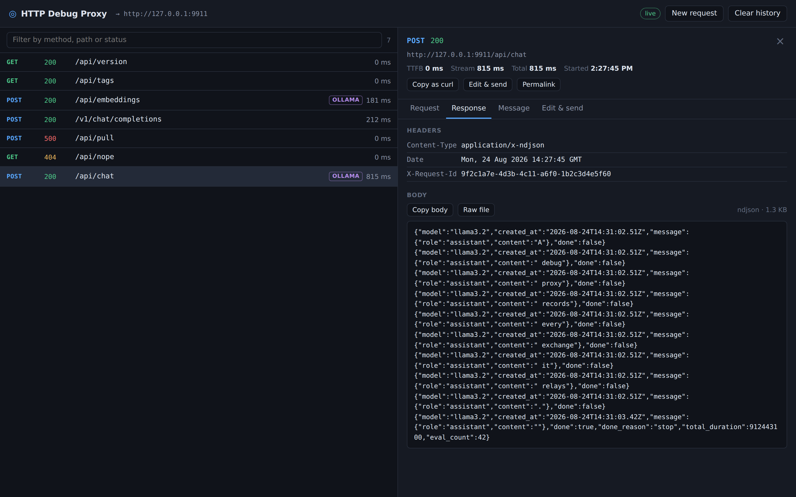
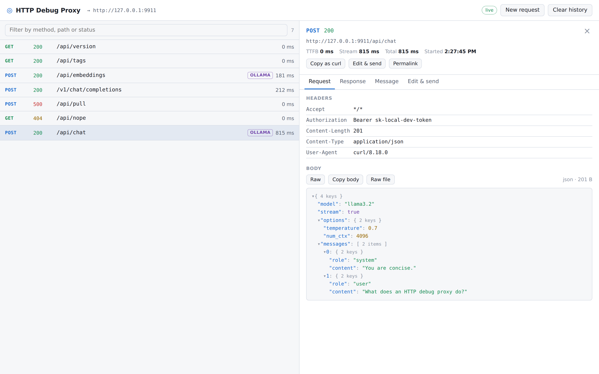
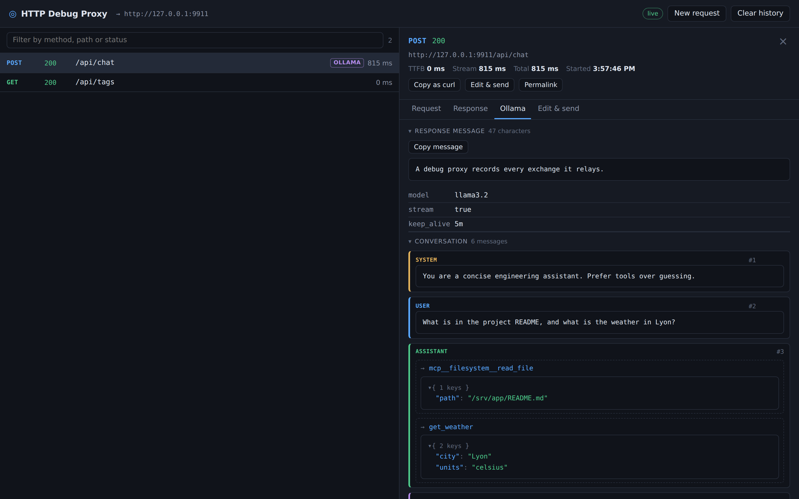

# HTTP Debug Proxy

A local HTTP debug proxy in a small Docker image: it relays your traffic to a target URL, captures every exchange, and shows it live in a web interface.



Built for debugging on a developer machine — inspecting what an SDK actually sends, why a streamed response stalls, or what a backend really answered. It has **no authentication** and is not meant to be reachable beyond your own machine.

## Features

- **Transparent relay** — the traffic is never modified, apart from an `X-Debug-Url` response header pointing at the detail page of the exchange.
- **Live capture** — requests appear as they arrive, and streamed responses (`ndjson`, SSE) grow on screen fragment by fragment.
- **Real streaming** — fragments reach your client as the backend produces them; nothing is buffered on the way through.
- **Useful timings** — time to first byte, streaming duration and total duration side by side, so a slow backend is distinguishable from a slow generation.
- **Readable payloads** — expandable JSON and XML trees, every header, query parameter and field copyable on its own.
- **Ollama aware** — calls to `/api/generate`, `/api/chat` and `/api/embeddings` get a dedicated tab: the assistant message reconstructed from the streamed fragments, the message history, the declared tools, and the MCP servers behind them.
- **Replay by editing** — reopen any request in a pre-filled form, change it, send it. The replay is sent by the server, so it can target any URL.
- **Optional persistence** — history survives a restart when a volume is mounted, and nothing breaks when it is not.

## Quick start

```bash
docker run --rm \
  -p 8080:8080 -p 8081:8081 \
  -e TARGET_URL=http://host.docker.internal:11434 \
  ghcr.io/drsmithfr/http-debug:latest
```

Send your traffic to `http://localhost:8080` instead of the target, and open <http://localhost:8081> to watch it.

```bash
curl -N http://localhost:8080/api/chat \
  -H 'Content-Type: application/json' \
  -d '{"model":"llama3.2","messages":[{"role":"user","content":"hello"}]}'
```

Every relayed response carries the link to its own detail page:

```
X-Debug-Url: http://localhost:8081/r/82a879f24f6d7253
```

### With Docker Compose

```yaml
services:
  debugproxy:
    image: ghcr.io/drsmithfr/http-debug:latest
    environment:
      TARGET_URL: http://ollama:11434
      PUBLIC_URL: http://localhost:8081
    ports:
      - "8080:8080" # proxy: send your traffic here
      - "8081:8081" # web interface
    volumes:
      - debugproxy-data:/data # optional: keeps history across restarts
    restart: unless-stopped

  ollama:
    image: ollama/ollama:latest
    volumes:
      - ollama-data:/root/.ollama

volumes:
  debugproxy-data:
  ollama-data:
```

A ready-to-run version of this file is in [`docker-compose.yml`](docker-compose.yml).

## Configuration

Everything is configured through environment variables. Only `TARGET_URL` is required.

| Variable | Default | Description |
| --- | --- | --- |
| `TARGET_URL` | *(required)* | Absolute URL the proxy relays to, for example `http://ollama:11434`. |
| `LISTEN_ADDR` | `:8080` | Listen address of the proxy. |
| `WEB_ADDR` | `:8081` | Listen address of the web interface. |
| `PUBLIC_URL` | `http://localhost:<WEB_ADDR port>` | Base URL used to build the `X-Debug-Url` header, as reachable from your machine. |
| `DATA_DIR` | `/data` | Directory holding the SQLite database and the body files. |
| `MAX_INLINE_BODY_SIZE` | `1048576` (1 MiB) | Size past which a body is written to disk instead of being kept inline. |
| `MAX_ENTRIES` | `1000` | Number of finished requests kept in the history. |
| `PENDING_TIMEOUT` | `5m` | Idle delay after which a request with no response is closed in error. |
| `SET_DEBUG_COOKIE` | `false` | Also set the detail URL as a cookie, for browser clients. |

Durations accept Go syntax (`30s`, `5m`, `1h30m`). Sizes are in bytes.

## The interface

Requests stream into the list on the left; clicking one opens its detail beside it while the list keeps updating. Drag the divider to resize the two panes — double-click it to go back to an even split, or focus it and use the arrow keys. The width is remembered across reloads. The detail header and its tabs stay in place while only the tab content scrolls.

| | |
| --- | --- |
|  |  |
| Headers, query parameters and body, each value copyable on its own. | The Ollama tab: reconstructed message, conversation, tools and MCP servers. |

### The Ollama tab

For a request flagged `is_ollama`, one tab collects everything a chat call carries:

- the **assistant message**, reconstructed from the streamed fragments and updated live;
- the **conversation** sent in the request — system, user, assistant and tool messages, with tool calls and their arguments;
- the **tools** declared to the model, with their descriptions and expandable JSON Schema;
- the **MCP servers** behind those tools, with the tools each one contributes.

MCP declarations reach a model in several shapes depending on the client, and all
three are folded into one server list: a top-level `mcp_servers` object, a tool of
`type: "mcp"` carrying `server_label` and `allowed_tools`, and tools flattened into
the `tools` array under an `mcp__<server>__<tool>` name.

**Copy as curl** turns any captured request into a command you can paste in a terminal. **Edit & send** reopens it in a pre-filled form; sending it creates a new entry flagged as a replay. Because the replay is issued by the server rather than the browser, it can target any URL, not just the configured one.

## HTTP API

The interface is a client of the same API, served on `WEB_ADDR`.

| Route | Description |
| --- | --- |
| `GET /api/requests` | List of entries, metadata only. Accepts `limit` and `before` (a cursor on `started_at`, in milliseconds). |
| `GET /api/requests/{id}` | Full entry. Bodies are inline under the threshold; past it, their size and the URL of the raw payload are returned. |
| `GET /api/requests/{id}/body/{side}` | Raw body, with `side` being `request` or `response`. Served with its original `Content-Type`. |
| `POST /api/requests` | Sends a composed request. Body `{method, url, headers, body}`, answers `{id}`. |
| `DELETE /api/requests` | Clears the history, database rows and body files alike. |
| `GET /api/events` | Server-Sent Events stream: `created`, `updated`, `delta`, `deleted`. |
| `GET /api/config` | Effective target URL, used by the interface. |

Full bodies never travel on the event stream; the detail view fetches them over the REST routes.

## How it works

The proxy captures the raw bytes of each exchange and interprets them separately, so capture stays agnostic to content. A response detected as `ndjson` or SSE is accumulated line by line and each fragment is published on the event stream; anything else is read through to the end.

Pending requests live in memory; once finished they move to SQLite. Bodies over `MAX_INLINE_BODY_SIZE` are written to `${DATA_DIR}/blobs/` and referenced by path. The history is capped at `MAX_ENTRIES`, and purging an entry deletes its body files in the same operation.

The design is documented in full in [`docs/SPECIFICATION.md`](docs/SPECIFICATION.md).

## Out of scope

- **No authentication or access control.** The tool assumes local use and displays captured authentication headers in clear text.
- **No TLS interception.** The proxy terminates in HTTP and can relay to an HTTPS target, but it does not decrypt traffic already encrypted between a client and its target.
- **HTTP only.** No raw TCP, no UDP.
- **No high availability.** One process, one database file.

## Development

Go 1.25 or later, no other dependency.

```bash
go test ./... -race -cover
TARGET_URL=http://localhost:11434 DATA_DIR=./data go run ./cmd/debugproxy
```

See [`CONTRIBUTING.md`](CONTRIBUTING.md) for the full workflow.

## License

Released into the public domain under [The Unlicense](LICENSE).
